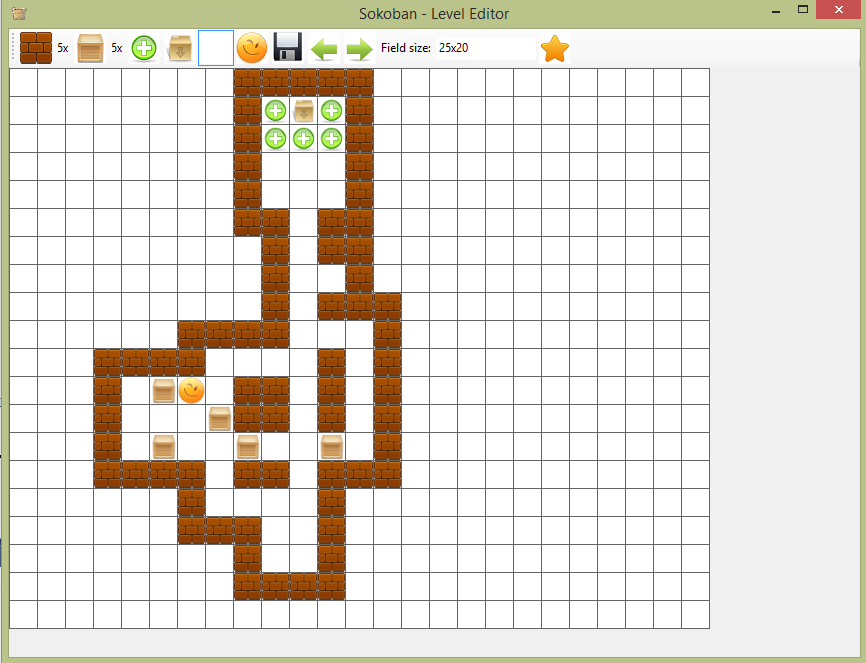

# Sokoban Level Editor
> Desktop application makes possible creation levels for my realization of Sokoban Game.

## Table of contents
* [General info](#general-info)
* [Screenshots](#screenshots)
* [Technologies](#technologies)
* [Contact](#contact)

## General info
Using the provided elements, such as walls, boxes, etc., we can form a level by simply inserting elements in the desired places. Left mouse button - insert element. Right mouse button - delete element.
Save levels to .txt file, which could be loaded in the Sokoban Game application.

## Screenshots

## Technologies
* C#
* Windows Forms

## Contact
Created by Anton Kozhanov [deal.for at gmail.com]
